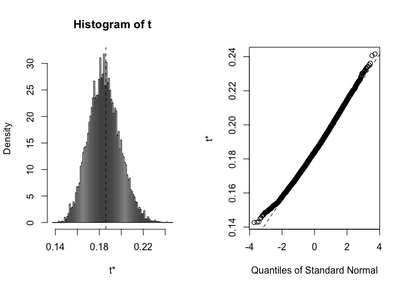

Prevalence of chronic pain in 15 European countries and Israel
==============================================================

Key
---

| Country     | Code |
|-------------|------|
| Spain       | A    |
| Ireland     | B    |
| UK          | C    |
| France      | D    |
| Switzerland | E    |
| Denmark     | F    |
| Israel      | G    |
| Germany     | H    |
| Netherlands | I    |
| Sweden      | J    |
| Finland     | K    |
| Austria     | L    |
| Belgium     | M    |
| Italy       | N    |
| Poland      | O    |
| Norway      | P    |

Data analysis
-------------

Load packages
-------------

``` r
library(dplyr)
library(boot)
```

Data entry
----------

``` r
# Data from Breivik et al., 2004 (Figure 1) Make dataframe including the 16
# countries (LETTERS), total population sampled in each country, Reported
# chronic pain prevalence
data <- data.frame(Site = LETTERS[1:16], TotalSample = c(3801, 2772, 3800, 3846, 
    2083, 2169, 2244, 3832, 3197, 2563, 2004, 2004, 2451, 3849, 3812, 2018), 
    Prevalence = c(0.12, 0.13, 0.13, 0.15, 0.16, 0.16, 0.17, 0.17, 0.18, 0.18, 
        0.19, 0.21, 0.23, 0.26, 0.27, 0.3))
# Convert to dplyr object
data <- tbl_df(data)
# Add columns with site weighting according to sample size, and number of
# people with chronicn pain for each site
data.1 <- data %>% mutate(SampleWeight = TotalSample/sum(TotalSample), TotalChronicPain = round(Prevalence * 
    TotalSample)) %>% select(Site, TotalSample, TotalChronicPain, Prevalence, 
    SampleWeight)
# Check data
data.1
```

    ## Source: local data frame [16 x 5]
    ## 
    ##      Site TotalSample TotalChronicPain Prevalence SampleWeight
    ##    (fctr)       (dbl)            (dbl)      (dbl)        (dbl)
    ## 1       A        3801              456       0.12   0.08183873
    ## 2       B        2772              360       0.13   0.05968350
    ## 3       C        3800              494       0.13   0.08181720
    ## 4       D        3846              577       0.15   0.08280762
    ## 5       E        2083              333       0.16   0.04484875
    ## 6       F        2169              347       0.16   0.04670040
    ## 7       G        2244              381       0.17   0.04831521
    ## 8       H        3832              651       0.17   0.08250619
    ## 9       I        3197              575       0.18   0.06883410
    ## 10      J        2563              461       0.18   0.05518355
    ## 11      K        2004              381       0.19   0.04314781
    ## 12      L        2004              421       0.21   0.04314781
    ## 13      M        2451              564       0.23   0.05277210
    ## 14      N        3849             1001       0.26   0.08287221
    ## 15      O        3812             1029       0.27   0.08207557
    ## 16      P        2018              605       0.30   0.04344924

Bootstrap mean
--------------

``` r
# Define 'boot' function to calculate the mean prevalence of chronic pain
func <- function(d, w) {
    sum(d$TotalChronicPain * w)/sum(d$TotalSample * w)
}
# Call 'boot' with defined function, using weights based on sample size, and
# 10 000 replicates
bootMeanPrev <- boot(data.1, func, R = 10000, stype = "w", weights = data.1$SampleWeight)
# View boot output
bootMeanPrev
```

    ## 
    ## WEIGHTED BOOTSTRAP
    ## 
    ## 
    ## Call:
    ## boot(data = data.1, statistic = func, R = 10000, stype = "w", 
    ##     weights = data.1$SampleWeight)
    ## 
    ## 
    ## Bootstrap Statistics :
    ##      original        bias    std. error  mean(t*)
    ## t1* 0.1859404 -0.0001775923  0.01394833 0.1845648

``` r
plot(bootMeanPrev)
```



Bootstrap 95% confidence interval
---------------------------------

``` r
# Calculate bootstrap 95% CI
boot.ciMeanPrev <- boot.ci(bootMeanPrev, type = "basic")
# View boot.ci output
boot.ciMeanPrev
```

    ## BOOTSTRAP CONFIDENCE INTERVAL CALCULATIONS
    ## Based on 10000 bootstrap replicates
    ## 
    ## CALL : 
    ## boot.ci(boot.out = bootMeanPrev, type = "basic")
    ## 
    ## Intervals : 
    ## Level      Basic         
    ## 95%   ( 0.1578,  0.2136 )  
    ## Calculations and Intervals on Original Scale

Session information
-------------------

``` r
sessionInfo()
```

    ## R version 3.2.2 (2015-08-14)
    ## Platform: x86_64-apple-darwin13.4.0 (64-bit)
    ## Running under: OS X 10.11 (El Capitan)
    ## 
    ## locale:
    ## [1] C
    ## 
    ## attached base packages:
    ## [1] stats     graphics  grDevices utils     datasets  methods   base     
    ## 
    ## other attached packages:
    ## [1] boot_1.3-17 dplyr_0.4.3
    ## 
    ## loaded via a namespace (and not attached):
    ##  [1] Rcpp_0.12.1     digest_0.6.8    assertthat_0.1  R6_2.1.1       
    ##  [5] DBI_0.3.1       formatR_1.2.1   magrittr_1.5    evaluate_0.8   
    ##  [9] stringi_0.5-5   lazyeval_0.1.10 rmarkdown_0.8.1 tools_3.2.2    
    ## [13] stringr_1.0.0   yaml_2.1.13     parallel_3.2.2  htmltools_0.2.6
    ## [17] knitr_1.11
