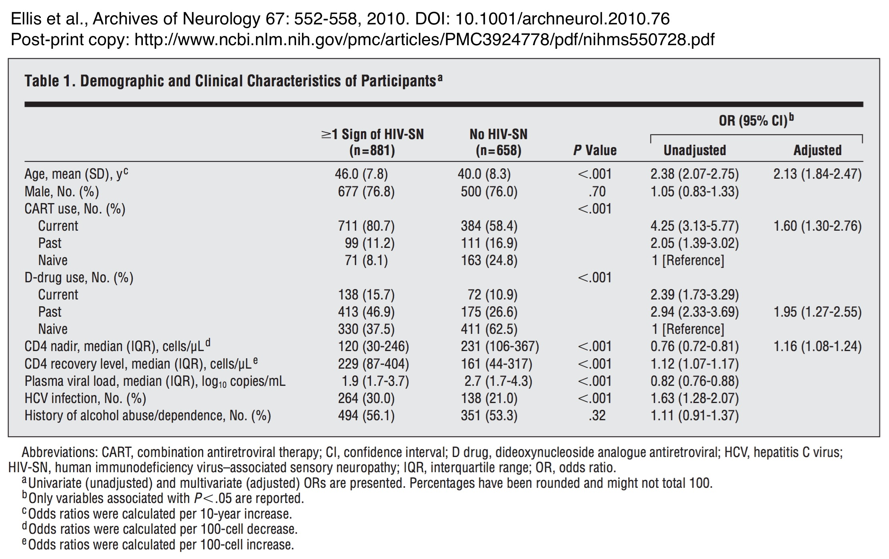
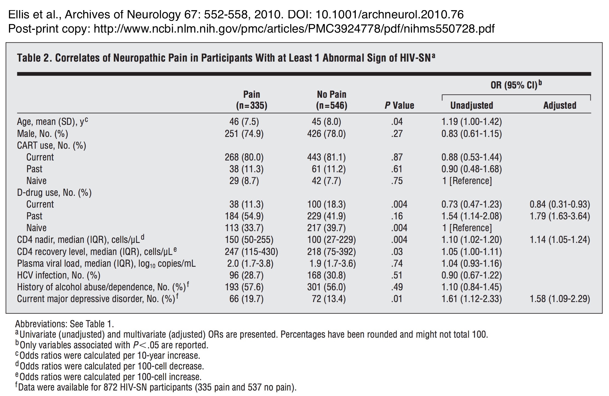

```{r session_setup, include = FALSE}
# Load packages
library(ggplot2)
library(scales)
library(grid)
library(readr)
library(dplyr)
library(tidyr)
library(knitr)
library(pander)
library(svglite)
library(ggiraph)

# knitr chunk options
opts_chunk$set(echo = TRUE,
               warning = FALSE,
               message = FALSE,
               cache = FALSE,
               fig.path = './figures/',
               dev = c('png', 'pdf', 'svg'),
               tidy = FALSE)
```

It has been a while since my last post *(I've been migrating the site from Wordpress to GitHub Pages)*, and I thought I would get back into the swing of things with a post on a topic close to my heart, **HIV-associated sensory neuropathy** (HIV-SN). The neuropathy *(damaged nerves)* affects the long sensory nerves from the hands and feet, producing reduced sensation. Somewhat counter-intuitively, this loss of sensation is often accompanied by chronic pain in the affected areas. The neuropathy is not fatal, but the loss of sensation, and particularly the pain, causes significant psychological, social, and economic problems for the person affected, their family/friends, and places a large burden on the healthcare system.

The mechanisms underlying the development of the neuropathy have not been clearly described, but one of the major risk factors for the neuropathy is exposure to older generation antiretroviral drugs *(ddX: stavudine, didanosine, zalcitabine)*, which are toxic to neurones. Imagine starting a treatment that saves your life, but potentially leaves you with chronic, intractable pain.

Because of their toxicity *(not just neuropathy, but a suite of other complications too)*, these older drugs were phased out of routine use in developed countries some time ago. More recently, there has been a steady shift away from using these drugs first-line in resource-poor countries too. With the global phasing out of neurotoxic ddX drugs, there is hope that the number of new cases of the neuropathy, and ultimately the total burden of the neuropathy, will fall. However, the epidemiological data to support this claim are scant. Head-to-head longitudinal efficacy and toxicological studies of old versus new antiretroviral treatments reported lower rates of the neuropathy in those people being treated with newer drugs, but these studies were poorly designed for detecting neuropathy in the first place. So where does that leave us in answering the question of whether we are witnessing the beginning of the end of HIV neuropathy?<br><br>

#### Enter the CHARTER study
One source of data that may shed light on problem is the National Institutes of Health (NIH)-funded CNS HIV Anti-Retroviral Therapy Effects Research [(CHARTER)](http://www.charternntc.org) study. The study is a prospective, multi-centre study in the US reporting on central (brain and spinal cord) and peripheral nervous system complications of HIV infections in cross-sectional (~1600 participants) and longitudinal (~650 participants) cohorts; all participants undergo comprehensive neurological and neurobehavioural assessment. In 2010, Ronald Ellis and colleagues published a fascinating paper describing the prevalence of HIV neuropathy in 1539 HIV-infected individuals enrolled between 2003 and 2007 *([Ellis et al., Arch Neurol 67: 552-558, 2010. DOI: 10.1001/archneurol.2010.76](http://www.ncbi.nlm.nih.gov/pmc/articles/PMC3924778/))*. They reported that **57%** (881/1539) of participants had HIV neuropathy *(defined as the presence of at least 1 abnormal clinical sign of neuropathy - reduced/absent vibration or pin-prick sensation in the feet and toes, or reduced ankle reflexes)*. But, despite providing the data (see Table 1 below) they did not report whether the prevalence of HIV neuropathy differed between patients depending on their exposure to neurotoxic antiretroviral drugs.<br><br>

{ style="display:block;margin-right:auto;margin-left:auto;max-width:100%;" }

<br><br>

Since the data are available, I saw an opportunity to look at whether the prevalence of HIV neuropathy did indeed differ between HIV-positive patients from the CHARTER study who were on combination antiretroviral therapy (cART), but who had *never been exposed* **(ddX-naive)** to neurotoxic ddX drugs, and those who *had been exposed* **(ddX-exposed)** at some time-point in their treatment.<br><br>

The analysis
------------
### Prevalence of HIV-SN
The first step in the analysis involved extracting the relevant data from Table 1 of Ellis *et al.* (2010). Because the extraction only included a small number of data points I performed the extraction manually.

```{r extract_data}
############################################################
#                                                          #
#       Extract data from Ellis et al (2010) table 1       #
#                                                          #
############################################################
# sn_ddX_exposed: Sensory neuropathy (sn), and have been exposed to ddX
# Data extracted: Currently using ddX + used ddX in the past
sn_ddX_exposed <- 138 + 413  

# sn_free_ddX_exposed: No sensory neuropathy (sn), and have been exposed to ddX  
# Data extracted: Currently using ddX + used ddX in the past  
sn_free_ddX_exposed <- 72 + 175  

# sn_ddX_naive: Sensory neuropathy (sn), and never been exposed to ddX  
# Data extracted: ddX-naive - cART-naive  
sn_ddX_naive <- 330 - 71  

# sn_free_ddX_naive: No sensory neuropathy (sn), and never been exposed to ddX  
# Data extracted: ddX-naive - cART-naive  
sn_free_ddX_naive <- 441 - 163  

############################################################
#                                                          #
#                 Tabulate extracted data                  #
#                                                          #
############################################################
# Put into dataframe
extr <- data_frame(Neuropathy = c('Yes', 'Yes', 'No', 'No'),
                   ddX_exposure = c('Yes', 'No', 'Yes', 'No'),
                   N = c(sn_ddX_exposed, sn_ddX_naive, sn_free_ddX_exposed, sn_free_ddX_naive))

# Tabulate
pander(extr, caption = 'Summary of data extracted from Table 1 of Ellis et al. (2010)',
       justify = 'left',
       split.tables = Inf)
```

Once I had extracted the data, I used the data to construct simulated datasets of the number of participants with *(sn)* and without *(sn\_free)* sensory neuropathy in the **ddX-naive** and **ddX-exposed** groups.<br><br>

```{r sim_data}
############################################################
#                                                          #
#                    Simulate datasets                     #
#                                                          #
############################################################
# ddX-naive data
ddX_naive <- c(rep('sn', sn_ddX_naive), 
               rep('sn_free', sn_free_ddX_naive)) %>% # generate the data
    sample(., 
           size = length(.), 
           replace = FALSE) # shuffle the pack (for no good reason)

# ddX-exposed data 
ddX_exposed <- c(rep('sn', sn_ddX_exposed), 
                 rep('sn_free', sn_free_ddX_exposed))  %>% # generate the data
    sample(., 
           size = length(.), 
           replace = FALSE) # shuffle the pack (for no good reason)

############################################################
#                                                          #
#                Tabulate simulated data                   #
#                                                          #
############################################################
# Put into dataframe
sim <- data_frame(Group = c('ddX_exposure', 'ddX_naive'),
                     `Neuropathy (n)` = c(length(ddX_exposed[ddX_exposed == 'sn']), 
                                          length(ddX_naive[ddX_naive == 'sn'])),
                     `No neuropathy (n)` = c(length(ddX_exposed[ddX_exposed == 'sn_free']),
                                             length(ddX_naive[ddX_naive == 'sn_free'])),
                     `Total (n)` = c(length(ddX_exposed),
                                     length(ddX_naive))) %>%
    mutate(`Prevalence (%)` = round(100 * (`Neuropathy (n)` / `Total (n)`)))

# Tabulate
pander(sim, caption = 'Summary of neuropathy prevalence in simulated datasets',
       justify = 'left',
       split.tables = Inf)

```

With only a glance at the table above you can see that the prevalence of neuropathy in patients exposed to ddX at some time-point in their HIV treatment was greater than that in patients never exposed to any of the ddX drugs (69% vs 48%). But, these are point estimates of disease prevalence, based on the group of people who volunteered to take part in the study. It would be nice to get an estimate of the range of values within which the prevalence is estimated to lie by constructing 95% confidence intervals of the prevalence. A handy approach to generating these confidence intervals is *bootstrapping*; a resampling method that allows the generation of an estimate of a population parameter (e.g., disease prevalence) from sample data by resampling (with replacement) the sample data. It boils down to using the sample cohort as the population. There are several very good _R_ packages that can be used to calculate bootstrap confidence intervals (the *'boot'* package by Brain Ripley and Angelo Canty springs to mind), but I chose to use perform the bootstrap use *base R* functions.<br><br>

```{r bootstrap_prevalence}
############################################################
#                                                          #
#        Bootstrap SN prevalence (resampling = 999)        #
#                                                          #
############################################################
# Step 1: Define function 'bootstrp' to generate the 95% confidence 
# interval of the prevalence.
# Generate a list ('boot_resample') containing 'B' bootstrap samples 
# of 'data' (default = 999 samples)
bootstrp <- function(data, B = 999){
    boot_resample <- list() # Create empty list
    for(i in 1:B){
    boot_resample[[i]] <- sample(x = data, 
                                 size = length(data), 
                                 replace = TRUE)
    }
    boot_resample
}

# Step 2: Run the function
ddX_exposed_2 <- bootstrp(ddX_exposed)
ddX_naive_2 <- bootstrp(ddX_naive)

# The next two steps could have been included in the 'boostrp' function, 
# but I decided to seperate them from the function to keep the 
# function simple, and make the process clearer.

# Step 3: Create a vector of neuropathy prevalence data for each item 
# in the output of 'bootstrp'
ddX_exposed_3 <- sapply(ddX_exposed_2,
                          function(y) round(100 * (length(y[y == 'sn']) / length(y))))
ddX_naive_3 <- sapply(ddX_naive_2,
                          function(y) round(100 * (length(y[y == 'sn']) / length(y))))

# Step 4: Get the lower (0.025) and upper (0.975) limits of the 
# vector of prevalence data
ddX_exposed_4 <- quantile(ddX_exposed_3,
                          probs = c(0.025, 0.975))
ddX_naive_4 <- quantile(ddX_naive_3,
                        probs = c(0.025, 0.975))

############################################################
#                                                          #
#                Tabulate bootstrap outputs                #
#                                                          #
############################################################
# Step 1: Prepare dataframe of simulated datasets (bootstrap sample)
df <- right_join(data_frame(N = 1:length(ddX_naive),
                             ddX_naive = factor(ddX_naive)),
                  data_frame(N = 1:length(ddX_exposed),
                             ddX_exposed = factor(ddX_exposed))) %>% # make a dataframe
    gather(Group, Neuropathy, ddX_naive, ddX_exposed) %>% # gather columns
    select(Group, Neuropathy) %>% # select required columns
    filter(!is.na(Neuropathy)) %>% # remove NA from join
    group_by(Group, Neuropathy) %>% 
    summarise(Count = n()) %>% # get counts from group_by
    spread(Neuropathy, Count) %>% # spread the Neuropathy column
    mutate(`Total (n)` = sn + sn_free,
           `Prevalence (%)` = round(100 * (sn / `Total (n)`))) %>%
    rename(`Neuropathy (n)`= sn, 
           `No neuropathy (n)` = sn_free) # rename columns

# Step 2: Add the bootstrap CI data to 'df'
df2 <- df %>%
    bind_cols(data.frame(Lower_95CI = c(ddX_exposed_4[1], ddX_naive_4[1]),
                         data.frame(Upper_95CI = c(ddX_exposed_4[2], ddX_naive_4[2])))) %>%
    rename(`Lower 95% CI` = Lower_95CI,
           `Upper 95% CI` = Upper_95CI)
# Step 3: Print table
pander(df2, caption = 'Neuropathy prevalence (95% bootstrap confidence interval) in simulated datasets',
       justify = 'left',
       split.tables = Inf)

############################################################
#                                                          #
#                   Plot bootstrap data                    #
#                                                          #
############################################################
# Step 1: Format 'df2' for plotting, including tooltip columns for 
# interactive graph labelling
Max <- data_frame(Max = c(max(ddX_exposed_3), max(ddX_naive_3)))
Min <- data_frame(Min = c(min(ddX_exposed_3), min(ddX_naive_3)))
tooltip_prev <- data_frame(tooltip_prev = c(paste0('Point prevalence: ', 
                                                   df2$`Prevalence (%)`[1], '%'),
                                            paste0('Point prevalence: ', 
                                                   df2$`Prevalence (%)`[2], '%')))
tooltip_95CI <- data_frame(tooltip_95CI = c(paste0('Bootstrap 95% CI: ', df2$`Lower 95% CI`[1], 
                                                   ' to ', df2$`Upper 95% CI`[1], '%'),
                                            paste0('Bootstrap 95% CI: ', df2$`Lower 95% CI`[2], 
                                                   ' to ', df2$`Upper 95% CI`[2], '%')))

df2_plot <- df2 %>%
    select(c(1,5:7)) %>%
    rename(Prevalence = `Prevalence (%)`,
           Lower_95CI = `Lower 95% CI`,
           Upper_95CI = `Upper 95% CI`) %>%
    bind_cols(Max, Min, tooltip_prev, tooltip_95CI)

# Step 2: Set palette
palette_dark <- c('#2a7eac', '#ac582a')
palette_light <- c('#61add8', '#d88c61')

# Step 3: Plot using interactive geoms from 'ggiraph' package
sn_plot <- ggplot(data = df2_plot,
                 aes(x = Group,
                     y = Prevalence,
                     fill = Group,
                     color = Group)) +
    geom_rect_interactive(aes(ymin = Min, 
                      ymax = Max, 
                      tooltip = tooltip_95CI),
                      xmin = c(0.75, 1.75), 
                      xmax = c(1.25, 2.25)) +
    geom_segment_interactive(aes(y = Prevalence,
                                 yend = Prevalence,
                                 x = c(0.75, 1.75), 
                                 xend = c(1.25, 2.25),
                                 tooltip = tooltip_prev),
                             size = 3) +
    labs(y = 'Neuropathy prevalence (%)\n') +
    scale_x_discrete(labels = c('Exposed\nto ddX', 'Never exposed\nto ddx')) +
    scale_y_continuous(limits = c(0, 100)) +
    scale_fill_manual(values = palette_light) +
    scale_colour_manual(values = palette_dark) +
    theme(legend.position = 'none',
          panel.background = element_blank(), 
          panel.grid.major = element_line(colour = "#dddddd"),
          plot.title = element_blank(),
          axis.ticks = element_line(colour = "#dddddd"),
          axis.title.x = element_blank(),
          axis.title = element_text(size = 18),
          axis.text = element_text(size = 18))

# Plot interactive graph
extra_css <- "background-color:#000000;color:#FFFFFF;font-family:helvetica;padding:10px;border-radius:10px 20px 10px 20px;"
ggiraph(code = print(sn_plot), 
        tooltip_extra_css = extra_css)
```
<p style="font-size:90%;max-width:70%;margin-left:auto;margin-right:auto;">
<b>Figure 1.</b> Point prevalence (with 95% bootstrap confidence intervals) of HIV neuropathy in simulated datasets based on neuropathy prevalence reported by Ellis <em>et al.</em> (2010). Data are shown for patients were/had been on combination antiretroviral therapy (cART), but who have never been exposed to the neurotoxic antiretroviral drugs <em>(Never exposed to ddX; Orange)</em>, and patients who were/had been on cART, and who had been exposed to ddX <em>(Exposed to ddX; Blue)</em>.
</p><br><br>

From the plot, you can clearly see that there was a much (~30%) lower prevalence of HIV neuropathy in those patients never exposed to neurotoxic ddX drugs compared to those who had been exposed *(if seeing isn't believing and you like to see a p-value, then see the table below)*. But, while the neuropathy was less common in patients treated with the newer drugs, almost half of the patient still had evidence of peripheral nerve damage; a substantial burden.<br><br>

#### Significance testing
```{r chi_squared_prevalence, echo = FALSE}
############################################################
#                                                          #
#                   Significance testing                   #
#                                                          #
############################################################
# Organise data for chi-square test
df_chi <- right_join(data_frame(N = 1:length(ddX_naive),
                             ddX_naive = factor(ddX_naive)),
                  data_frame(N = 1:length(ddX_exposed),
                             ddX_exposed = factor(ddX_exposed))) %>%
    gather(Group, Neuropathy, ddX_naive, ddX_exposed) %>%
    mutate(Group = factor(Group),
           Neuropathy = factor(Neuropathy)) %>%
    select(Group, Neuropathy)

ddX_exposure <- df_chi[[1]]
sn_status <- df_chi[[2]]

# Perform chi-square with simulated p-value, and tabulate output
pander(chisq.test(x = ddX_exposure, 
                  y = sn_status,
                  simulate.p.value = TRUE, B = 999),
    justify = 'left',
    split.tables = Inf)
```

### Is the neuropathy still painful?
As I mentioned earlier, pain is a common symptom of the neuropathy, and this pain causes significant dysfuction and distress. Consequently, having shown that exposure to newer, less neurotoxic treatments is associated with reduced prevalence of HIV neuropathy compared with older drugs, it stands to reason that when neuropathy is present, the severity of the neuropathy associated with these newer drugs may be less than that induced by the older drugs. Therefore, I also looked at the frequency of painful symptoms in **ddX-exposed** and **ddX-naive** patients reported on by Ellis and colleagues (2010) that had at least one clinical sign of peripheral nerve damage (i.e., only patients who had a neuropathy). This new analysis followed exactly the same procedures as those described above, except that I took the data from Table 2 of Ellis *et al.* (2010) (see below). So, other than showing which data I extracted from Table 2, I have not shown the *R* scripts for this section (your can find the full *.Rmd* file on [GitHub](http://github.com/kamermanpr/second-look-PAIN/ellis-2010))<br><br>

{ style="display:block;margin-right:auto;margin-left:auto;max-width:100%;" }

<br><br>

Here are the data I extracted from Table 2 of Ellis *et al.* (2010).<br><br>

```{r extract_data_pain}
############################################################
#                                                          #
#       Extract data from Ellis et al (2010) table 1       #
#                                                          #
############################################################
# Extract data 
# pain_ddX_exposed: painful sensory neuropathy (pain), and have been exposed to ddX
# Data extracted: Currently using ddX + used ddX in the past
pain_ddX_exposed <- 38 + 184  

# pain_free_ddX_exposed: Nonpainful sensory neuropathy (pain_free), and have 
# been exposed to ddX
# Data extracted: Currently using ddX + used ddX in the past  
pain_free_ddX_exposed <- 100 + 229  

# pain_ddX_naive: Painful sensory neuropathy (pain), and never been exposed to ddX  
# Data extracted: ddX-naive - cART-naive  
pain_ddX_naive <- 113 - 29  

# pain_free_ddX_naive: Nonpainful sensory neuropathy (pain_free), and never 
# been exposed to ddX  
# Data extracted: ddX-naive - cART-naive  
pain_free_ddX_naive <- 217 - 42  

############################################################
#                                                          #
#                 Tabulate extracted data                  #
#                                                          #
############################################################
# Put into dataframe
extr_pain <- data_frame(Pain = c('Yes', 'Yes', 'No', 'No'),
                   ddX_exposure = c('Yes', 'No', 'Yes', 'No'),
                   N = c(pain_ddX_exposed, pain_ddX_naive, 
                         pain_free_ddX_exposed, pain_free_ddX_naive))

# Tabulate
pander(extr_pain, caption = 'Summary of data extracted from Table 2 of Ellis et al. (2010)',
       justify = 'left',
       split.tables = Inf)
```

Following data extraction, I simulated datasets of the number of participants with *(pain)* and without *(pain\_free)* painful sensory neuropathy in the *ddX-naive* and *ddX-exposed* groups, and then calculated and plotted bootstrap 95% confidence intervals.<br><br>

```{r sim_data_pain}
############################################################
#                                                          #
#                    Simulate datasets                     #
#                                                          #
############################################################
# ddX-naive data
ddX_naive_pain <- c(rep('pain', pain_ddX_naive), 
               rep('pain_free', pain_free_ddX_naive)) %>% # generate the data
    sample(., 
           size = length(.), 
           replace = FALSE) # shuffle the pack (for no good reason)

# ddX-exposed data 
ddX_exposed_pain <- c(rep('pain', pain_ddX_exposed), 
                 rep('pain_free', pain_free_ddX_exposed))  %>% # generate the data
    sample(., 
           size = length(.), 
           replace = FALSE) # shuffle the pack (for no good reason)

############################################################
#                                                          #
#                Tabulate simulated data                   #
#                                                          #
############################################################
# Put into dataframe
sim <- data_frame(Group = c('ddX_exposure', 'ddX_naive'),
                     `Pain (n)` = c(length(ddX_exposed_pain[ddX_exposed_pain == 'pain']), 
                                          length(ddX_naive_pain[ddX_naive_pain == 'pain'])),
                     `No pain (n)` = c(length(ddX_exposed_pain[ddX_exposed_pain == 'pain_free']),
                                             length(ddX_naive_pain[ddX_naive_pain == 'pain_free'])),
                     `Total (n)` = c(length(ddX_exposed_pain),
                                     length(ddX_naive_pain))) %>%
    mutate(`Prevalence (%)` = round(100 * (`Pain (n)` / `Total (n)`)))

# Tabulate
pander(sim, caption = 'Summary of pain prevalence in simulated datasets',
       justify = 'left',
       split.tables = Inf)

```

```{r bootstrap_pain}
############################################################
#                                                          #
#        Bootstrap SN prevalence (resampling = 999)        #
#                                                          #
############################################################
# Step 1: Define function 'bootstrp' (already done)

# Step 2: Run the function
ddX_exposed_pain_2 <- bootstrp(ddX_exposed_pain)
ddX_naive_pain_2 <- bootstrp(ddX_naive_pain)

# Step 3: Create a vector of neuropathy prevalence data for each item 
# in the output of 'bootstrp'
ddX_exposed_pain_3 <- sapply(ddX_exposed_pain_2,
                          function(y) round(100 * (length(y[y == 'pain']) / length(y))))
ddX_naive_pain_3 <- sapply(ddX_naive_pain_2,
                          function(y) round(100 * (length(y[y == 'pain']) / length(y))))

# Step 4: Get the lower (0.025) and upper (0.975) limits of the 
# vector of prevalence data
ddX_exposed_pain_4 <- quantile(ddX_exposed_pain_3,
                          probs = c(0.025, 0.975))
ddX_naive_pain_4 <- quantile(ddX_naive_pain_3,
                        probs = c(0.025, 0.975))

############################################################
#                                                          #
#                Tabulate bootstrap outputs                #
#                                                          #
############################################################
# Step 1: Prepare dataframe of simulated datasets (bootstrap sample)
df_pain <- right_join(data_frame(N = 1:length(ddX_naive_pain),
                             ddX_naive = factor(ddX_naive_pain)),
                  data_frame(N = 1:length(ddX_exposed_pain),
                             ddX_exposed = factor(ddX_exposed_pain))) %>% # make a dataframe
    gather(Group, Pain, ddX_naive, ddX_exposed) %>% # gather columns
    select(Group, Pain) %>% # select required columns
    filter(!is.na(Pain)) %>% # remove NA from join
    group_by(Group, Pain) %>% 
    summarise(Count = n()) %>% # get counts from group_by
    spread(Pain, Count) %>% # spread the Neuropathy column
    mutate(`Total (n)` = pain + pain_free,
           `Prevalence (%)` = round(100 * (pain / `Total (n)`))) %>%
    rename(`Pain (n)`= pain, 
           `No pain (n)` = pain_free) # rename columns

# Step 2: Add the bootstrap CI data to 'df_pain'
df2_pain <- df_pain %>%
    bind_cols(data.frame(Lower_95CI = c(ddX_exposed_pain_4[1], ddX_naive_pain_4[1]),
                         data.frame(Upper_95CI = c(ddX_exposed_pain_4[2], ddX_naive_pain_4[2])))) %>%
    rename(`Lower 95% CI` = Lower_95CI,
           `Upper 95% CI` = Upper_95CI)

# Step 3: Print table
pander(df2_pain, caption = 'Painful neuropathy prevalence (95% bootstrap confidence interval) in simulated datasets',
       justify = 'left',
       split.tables = Inf)

############################################################
#                                                          #
#                   Plot bootstrap data                    #
#                                                          #
############################################################
# Step 1: Format df2_pain for plotting, including tooltip columns 
# for interactive graph labelling
Max <- data_frame(Max = c(max(ddX_exposed_pain_3), max(ddX_naive_pain_3)))
Min <- data_frame(Min = c(min(ddX_exposed_pain_3), min(ddX_naive_pain_3)))
tooltip_prev <- data_frame(tooltip_prev = c(paste0('Point prevalence: ',
                                        df2_pain$`Prevalence (%)`[1], '%'),
                                 paste0('Point prevalence: ', 
                                        df2_pain$`Prevalence (%)`[2], '%')))
tooltip_95CI <- data_frame(tooltip_95CI = c(paste0('Bootstrap 95% CI: ',
                                                   df2_pain$`Lower 95% CI`[1], 
                                                   ' to ',
                                                   df2_pain$`Upper 95% CI`[1], '%'),
                                            paste0('Bootstrap 95% CI: ',
                                                   df2_pain$`Lower 95% CI`[2], 
                                                   ' to ',
                                                   df2_pain$`Upper 95% CI`[2], '%')))

df2_pain_plot <- df2_pain %>%
    select(c(1,5:7)) %>%
    rename(Prevalence = `Prevalence (%)`,
           Lower_95CI = `Lower 95% CI`,
           Upper_95CI = `Upper 95% CI`) %>%
    bind_cols(Max, Min, tooltip_prev, tooltip_95CI)

# Step 2: Set palette
palette_dark <- c('#2a7eac', '#ac582a')
palette_light <- c('#61add8', '#d88c61')

# Step 3: Plot using interactive geoms from 'ggiraph' package
sn_pain <- ggplot(data = df2_pain_plot,
                 aes(x = Group,
                     y = Prevalence,
                     fill = Group,
                     color = Group)) +
    geom_rect_interactive(aes(ymin = Min, 
                      ymax = Max, 
                      tooltip = tooltip_95CI),
                      xmin = c(0.75, 1.75), 
                      xmax = c(1.25, 2.25)) +
    geom_segment_interactive(aes(y = Prevalence,
                                 yend = Prevalence,
                                 x = c(0.75, 1.75), 
                                 xend = c(1.25, 2.25),
                                 tooltip = tooltip_prev),
                             size = 3) +
    labs(y = 'Painful neuropathy prevalence (%)\n') +
    scale_x_discrete(labels = c('Exposed\nto ddX', 'Never exposed\nto ddx')) +
    scale_y_continuous(limits = c(0, 100)) +
    scale_fill_manual(values = palette_light) +
    scale_colour_manual(values = palette_dark) +
    theme(legend.position = 'none',
          panel.background = element_blank(), 
          panel.grid.major = element_line(colour = "#dddddd"),
          plot.title = element_blank(),
          axis.ticks = element_line(colour = "#dddddd"),
          axis.title.x = element_blank(),
          axis.title = element_text(size = 18),
          axis.text = element_text(size = 18))
# Step 4: Plot interactive graph
extra_css <- "background-color:#000000;color:#FFFFFF;font-family:helvetica;padding:10px;border-radius:10px 20px 10px 20px;"
ggiraph(code = print(sn_pain), 
        tooltip_extra_css = extra_css)
```
<p style="font-size:90%;max-width:70%;margin-right:auto;margin-left:auto;">
<b>Figure 1.</b> Point prevalence (with 95% bootstrap confidence intervals) of painful HIV neuropathy in simulated datasets based on the prevalence of painfulperipheral neuropathy reported by Ellis <em>et al.</em> (2010). Data are shown for patients with a clinically diagnosed neuropathy, and were/had been on combination antiretroviral therapy (cART), but who have never been exposed to the neurotoxic antiretroviral drugs <em>(Never exposed to ddX; Orange)</em>, and patients who were/had been on cART, and who had been exposed to ddX <em>(Exposed to ddX; Blue)</em>.
</p><br><br>

From the plot, you can see that there was a slightly lower prevalence of painful HIV neuropathy in those patients never exposed to neurotoxic ddX drugs compared to those who had been exposed *(there is overlap of the lower limit of the ddX-exposed group and the upper limit of the ddX-naive group)*. Like before, if seeing isn't believing and you like to see a *p-value*, then see the table below. So, the newer drugs do appear to reduce the severity of the painful symptoms of the neuropathy compared with older ddX drugs, but like the findings for neuropathy *per se*, there still was a high burden of pain in those with neuropathy and who had only ever been exposed to newer treatments.<br><br>

```{r chi_squared_pain}
############################################################
#                                                          #
#                   Significance testing                   #
#                                                          #
############################################################
# Organise data for chi-square test
df_pain_chi <- right_join(data_frame(N = 1:length(ddX_naive_pain),
                             ddX_naive = factor(ddX_naive_pain)),
                  data_frame(N = 1:length(ddX_exposed_pain),
                             ddX_exposed = factor(ddX_exposed_pain))) %>%
    gather(Group, Pain, ddX_naive, ddX_exposed) %>%
    mutate(Group = factor(Group),
           Pain = factor(Pain)) %>%
    select(Group, Pain)

ddX_exposure <- df_pain_chi[[1]]
pain_status <- df_pain_chi[[2]]

# Perform chi-square with simulated p-value, and tabulate output
pander(chisq.test(x = ddX_exposure, 
                  y = pain_status,
                  simulate.p.value = TRUE, B = 999),
    justify = 'left',
    split.tables = Inf)
```

### Take-home message
_**HIV neuropathy is not going to disappear anytime soon.**_   

While the frequency of HIV neuropathy, and the painful symptoms of the neuropathy, was markedly reduced in patients on modern treatment regimens compared to those exposed to older, neurotoxic treatments, the burden of neuropathy (and pain) was *still unacceptably high*. These data indicate that the burden of this chronic complication of HIV infection may well decrease over time, but healthcare professionals still need to be cognisant that many of their patients, even if never exposed to ddX drugs, are still at risk of neuropathy, and its painful sequela. 

****

### Analysis script
The analysis script for this blog post can be found under the _ellis-2010_ subdirectory of the _[second-look-PAIN](http://github.com/kamermanpr/second-look-PAIN)_ GitHub repository.

### Citation
Peter Kamerman. (2016). HIV neuropathy: Going, going...but not gone. Figshare DOI: [10.6084/m9.figshare.2656255 ](http://dx.doi.org/10.6084/m9.figshare.2656255)

****

### Session information
```{r session_information, echo = FALSE}
sessionInfo()
rm(list = ls())
```
