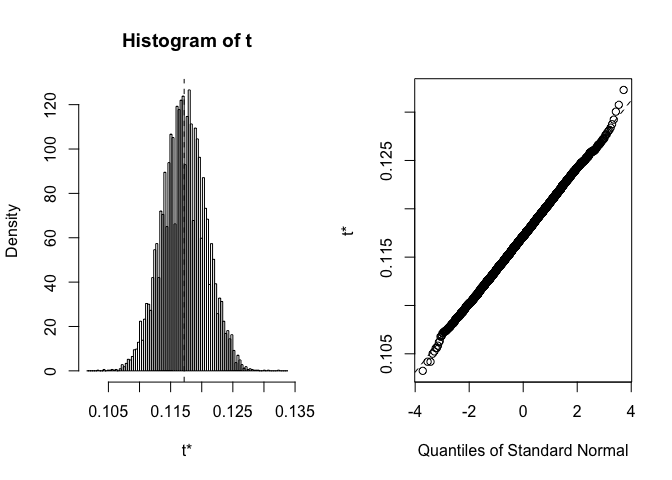
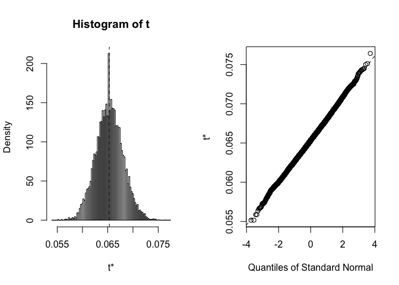
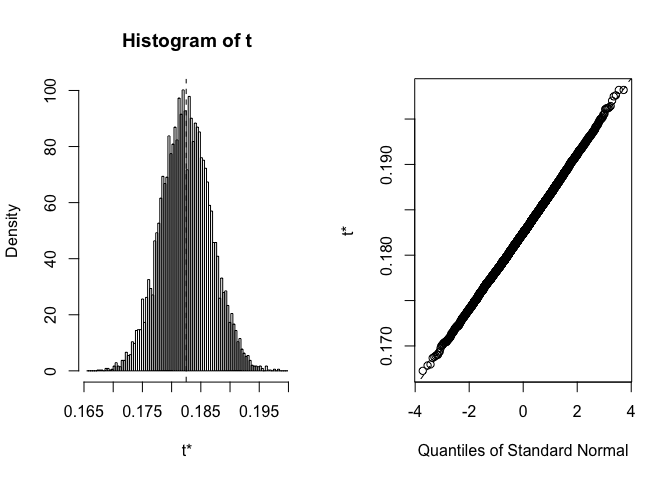
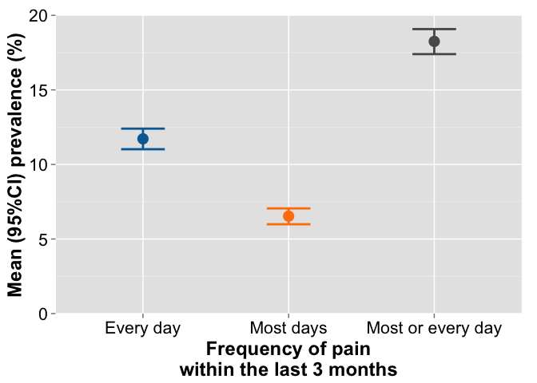

Prevalence of chronic pain in the US (2012)
===========================================

Summary
-------

Data analysis
-------------

### Data entry and simulation

``` r
# Total sample from the 2012 NHIS Adult Functioning and Disability
# Supplement (AFD) No pain:
NoPain <- 3663
# Pain some days:
SomeDays <- 3258
# Pain most days:
MostDays <- 553
# Pain every day:
EveryDay <- 992
# Pain on most/every day:
MostEvery <- MostDays + EveryDay
# Total sample
Total <- sum(NoPain, SomeDays, MostDays, EveryDay)
Total
```

    ## [1] 8466

``` r
# Proportion with pain every day within the last 3 months
EveryDay.P <- EveryDay/Total
EveryDay.P
```

    ## [1] 0.1171746

``` r
# Proportion with pain most days within the last 3 months
MostDays.P <- MostDays/Total
MostDays.P
```

    ## [1] 0.0653201

``` r
# Proportion with pain on most or every day within the last 3 months
MostEvery.P <- MostEvery/Total
MostEvery.P
```

    ## [1] 0.1824947

``` r
# Simulations Create dataset
Sim <- data.frame(EveryDay = factor(c(rep("Other", Total - EveryDay), rep("Chronic pain", 
    EveryDay)), levels = c("Other", "Chronic pain"), labels = c("Other", "Chronic pain")), 
    MostDays = factor(c(rep("Other", Total - MostDays), rep("Pain on most days", 
        MostDays)), levels = c("Other", "Pain on most days"), labels = c("Other", 
        "Pain on most days")), MostEvery = factor(c(rep("Other", Total - MostEvery), 
        rep("Pain on most.every day", MostEvery)), levels = c("Other", "Pain on most.every day"), 
        labels = c("Other", "Pain on most.every day")))
# 'Top-and-tail' dataset
head(Sim)
```

    ##   EveryDay MostDays MostEvery
    ## 1    Other    Other     Other
    ## 2    Other    Other     Other
    ## 3    Other    Other     Other
    ## 4    Other    Other     Other
    ## 5    Other    Other     Other
    ## 6    Other    Other     Other

``` r
tail(Sim)
```

    ##          EveryDay          MostDays              MostEvery
    ## 8461 Chronic pain Pain on most days Pain on most.every day
    ## 8462 Chronic pain Pain on most days Pain on most.every day
    ## 8463 Chronic pain Pain on most days Pain on most.every day
    ## 8464 Chronic pain Pain on most days Pain on most.every day
    ## 8465 Chronic pain Pain on most days Pain on most.every day
    ## 8466 Chronic pain Pain on most days Pain on most.every day

``` r
str(Sim)
```

    ## 'data.frame':    8466 obs. of  3 variables:
    ##  $ EveryDay : Factor w/ 2 levels "Other","Chronic pain": 1 1 1 1 1 1 1 1 1 1 ...
    ##  $ MostDays : Factor w/ 2 levels "Other","Pain on most days": 1 1 1 1 1 1 1 1 1 1 ...
    ##  $ MostEvery: Factor w/ 2 levels "Other","Pain on most.every day": 1 1 1 1 1 1 1 1 1 1 ...

``` r
## Summarise data
library(pander)
pander(table(Sim$EveryDay), caption = "Pain every day with the last 3 months (chronic pain)", 
    justify = "left", type = "rmarkdown")
```

<table>
<caption>Pain every day with the last 3 months (chronic pain)</caption>
<colgroup>
<col width="11%" />
<col width="19%" />
</colgroup>
<thead>
<tr class="header">
<th align="left">Other</th>
<th align="left">Chronic pain</th>
</tr>
</thead>
<tbody>
<tr class="odd">
<td align="left">7474</td>
<td align="left">992</td>
</tr>
</tbody>
</table>

``` r
pander(table(Sim$MostDays), caption = "Pain most days with the last 3 months", 
    justify = "left", type = "rmarkdown")
```

<table>
<caption>Pain most days with the last 3 months</caption>
<colgroup>
<col width="11%" />
<col width="26%" />
</colgroup>
<thead>
<tr class="header">
<th align="left">Other</th>
<th align="left">Pain on most days</th>
</tr>
</thead>
<tbody>
<tr class="odd">
<td align="left">7913</td>
<td align="left">553</td>
</tr>
</tbody>
</table>

``` r
pander(table(Sim$MostEvery), caption = "Pain most or every day with the last 3 months", 
    justify = "left", type = "rmarkdown")
```

<table>
<caption>Pain most or every day with the last 3 months</caption>
<colgroup>
<col width="11%" />
<col width="33%" />
</colgroup>
<thead>
<tr class="header">
<th align="left">Other</th>
<th align="left">Pain on most.every day</th>
</tr>
</thead>
<tbody>
<tr class="odd">
<td align="left">6921</td>
<td align="left">1545</td>
</tr>
</tbody>
</table>

### Bootstrap prevalence and 95% confidence interval

``` r
## Bootstrap mean and 95%CI
library(boot)
### Write function to calculate prevalence using bootstrap sample
prev <- function(d, i) {
    dat <- d[i, ]
    tab <- table(dat)
    num <- tab[[2]]
    den <- tab[[1]] + tab[[2]]
    prev <- num/den
    prev
}
### Split the dataframe
EveryDay.1 <- data.frame(Sim[, 1])
MostDays.1 <- data.frame(Sim[, 2])
MostEvery.1 <- data.frame(Sim[, 3])
### Run boot with 10 000 reps Pain every day within the last 3 months
EveryDay.boot <- boot(EveryDay.1, prev, 10000)
plot(EveryDay.boot)
```



``` r
EveryDay.boot
```

    ## 
    ## ORDINARY NONPARAMETRIC BOOTSTRAP
    ## 
    ## 
    ## Call:
    ## boot(data = EveryDay.1, statistic = prev, R = 10000)
    ## 
    ## 
    ## Bootstrap Statistics :
    ##      original        bias    std. error
    ## t1* 0.1171746 -1.053626e-05 0.003514358

``` r
EveryDay.bootci <- boot.ci(EveryDay.boot, conf = 0.95, type = "basic")
EveryDay.bootci
```

    ## BOOTSTRAP CONFIDENCE INTERVAL CALCULATIONS
    ## Based on 10000 bootstrap replicates
    ## 
    ## CALL : 
    ## boot.ci(boot.out = EveryDay.boot, conf = 0.95, type = "basic")
    ## 
    ## Intervals : 
    ## Level      Basic         
    ## 95%   ( 0.1102,  0.1240 )  
    ## Calculations and Intervals on Original Scale

``` r
#### Pain on most days within the last 3 months
MostDays.boot <- boot(MostDays.1, prev, 10000)
plot(MostDays.boot)
```



``` r
MostDays.boot
```

    ## 
    ## ORDINARY NONPARAMETRIC BOOTSTRAP
    ## 
    ## 
    ## Call:
    ## boot(data = MostDays.1, statistic = prev, R = 10000)
    ## 
    ## 
    ## Bootstrap Statistics :
    ##      original       bias    std. error
    ## t1* 0.0653201 1.898181e-05 0.002695485

``` r
MostDays.bootci <- boot.ci(MostDays.boot, conf = 0.95, type = "basic")
MostDays.bootci
```

    ## BOOTSTRAP CONFIDENCE INTERVAL CALCULATIONS
    ## Based on 10000 bootstrap replicates
    ## 
    ## CALL : 
    ## boot.ci(boot.out = MostDays.boot, conf = 0.95, type = "basic")
    ## 
    ## Intervals : 
    ## Level      Basic         
    ## 95%   ( 0.0599,  0.0705 )  
    ## Calculations and Intervals on Original Scale

``` r
#### Pain on most or every day within the last 3 months
MostEvery.boot <- boot(MostEvery.1, prev, 10000)
plot(MostEvery.boot)
```



``` r
MostEvery.boot
```

    ## 
    ## ORDINARY NONPARAMETRIC BOOTSTRAP
    ## 
    ## 
    ## Call:
    ## boot(data = MostEvery.1, statistic = prev, R = 10000)
    ## 
    ## 
    ## Bootstrap Statistics :
    ##      original       bias    std. error
    ## t1* 0.1824947 -1.44224e-05 0.004253526

``` r
MostEvery.bootci <- boot.ci(MostEvery.boot, conf = 0.95, type = "basic")
MostEvery.bootci
```

    ## BOOTSTRAP CONFIDENCE INTERVAL CALCULATIONS
    ## Based on 10000 bootstrap replicates
    ## 
    ## CALL : 
    ## boot.ci(boot.out = MostEvery.boot, conf = 0.95, type = "basic")
    ## 
    ## Intervals : 
    ## Level      Basic         
    ## 95%   ( 0.1740,  0.1908 )  
    ## Calculations and Intervals on Original Scale

### Summary plot

``` r
# Make dataset for plotting
plotD <- data.frame(Group = c("Every day", "Most days", "Most or every day"), 
    Mean = c(100 * EveryDay.boot$t0, 100 * MostDays.boot$t0, 100 * MostEvery.boot$t0), 
    LowerCI = c(100 * EveryDay.bootci$basic[4], 100 * MostDays.bootci$basic[4], 
        100 * MostEvery.bootci$basic[4]), UpperCI = c(100 * EveryDay.bootci$basic[5], 
        100 * MostDays.bootci$basic[5], 100 * MostEvery.bootci$basic[5]), RangeCI = c(100 * 
        EveryDay.bootci$basic[5] - 100 * EveryDay.bootci$basic[4], 100 * MostDays.bootci$basic[5] - 
        100 * MostDays.bootci$basic[4], 100 * MostEvery.bootci$basic[5] - 100 * 
        MostEvery.bootci$basic[4]))
## View dataset
pander(plotD, caption = "Summary (mean and bootstrap 95%CI) of pain frequency within the last 3 months", 
    justify = "left", type = "rmarkdown")
```

<table>
<caption>Summary (mean and bootstrap 95%CI) of pain frequency within the last 3 months</caption>
<colgroup>
<col width="25%" />
<col width="9%" />
<col width="13%" />
<col width="13%" />
<col width="13%" />
</colgroup>
<thead>
<tr class="header">
<th align="left">Group</th>
<th align="left">Mean</th>
<th align="left">LowerCI</th>
<th align="left">UpperCI</th>
<th align="left">RangeCI</th>
</tr>
</thead>
<tbody>
<tr class="odd">
<td align="left">Every day</td>
<td align="left">11.72</td>
<td align="left">11.02</td>
<td align="left">12.4</td>
<td align="left">1.382</td>
</tr>
<tr class="even">
<td align="left">Most days</td>
<td align="left">6.532</td>
<td align="left">5.989</td>
<td align="left">7.052</td>
<td align="left">1.063</td>
</tr>
<tr class="odd">
<td align="left">Most or every day</td>
<td align="left">18.25</td>
<td align="left">17.4</td>
<td align="left">19.08</td>
<td align="left">1.677</td>
</tr>
</tbody>
</table>

``` r
## Plot data
library(ggplot2)
library(grid)
library(scales)
library(ggthemes)
# Make a three-colour colourblind palette
cbpalette <- tableau_color_pal("colorblind10")(4)
cbpalette <- cbpalette[-3]
gg.5 <- ggplot(plotD, aes(x = Group, y = Mean, colour = Group)) + geom_point(size = 5) + 
    geom_errorbar(aes(ymin = LowerCI, ymax = UpperCI), width = 0.3, size = 1) + 
    labs(x = "Frequency of pain\nwithin the last 3 months", y = "Mean (95%CI) prevalence (%)") + 
    scale_y_continuous(limits = c(0, 20), expand = c(0, 0)) + scale_colour_manual(values = cbpalette) + 
    theme(legend.position = "none", axis.text = element_text(size = 16, colour = "black"), 
        axis.title.x = element_text(size = 18, colour = "black", face = "bold", 
            vjust = 0), axis.title.y = element_text(size = 18, colour = "black", 
            face = "bold", vjust = 1))
gg.5
```



### Session information

``` r
sessionInfo()
```

    ## R version 3.2.2 (2015-08-14)
    ## Platform: x86_64-apple-darwin13.4.0 (64-bit)
    ## Running under: OS X 10.11 (El Capitan)
    ## 
    ## locale:
    ## [1] C
    ## 
    ## attached base packages:
    ## [1] grid      stats     graphics  grDevices utils     datasets  methods  
    ## [8] base     
    ## 
    ## other attached packages:
    ## [1] ggthemes_2.2.1 scales_0.3.0   ggplot2_1.0.1  boot_1.3-17   
    ## [5] pander_0.5.2  
    ## 
    ## loaded via a namespace (and not attached):
    ##  [1] Rcpp_0.12.1      digest_0.6.8     MASS_7.3-44      plyr_1.8.3      
    ##  [5] gtable_0.1.2     formatR_1.2.1    magrittr_1.5     evaluate_0.8    
    ##  [9] stringi_0.5-5    reshape2_1.4.1   rmarkdown_0.8.1  labeling_0.3    
    ## [13] proto_0.3-10     tools_3.2.2      stringr_1.0.0    munsell_0.4.2   
    ## [17] yaml_2.1.13      colorspace_1.2-6 htmltools_0.2.6  knitr_1.11
